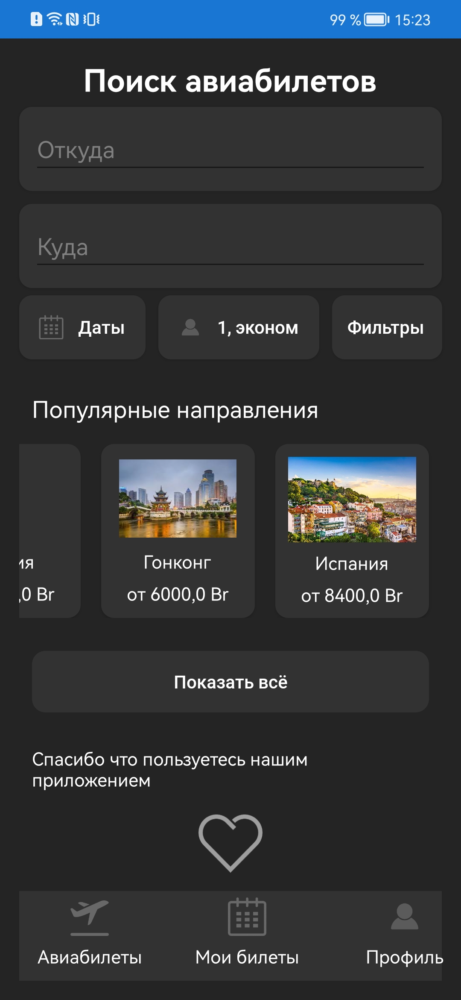
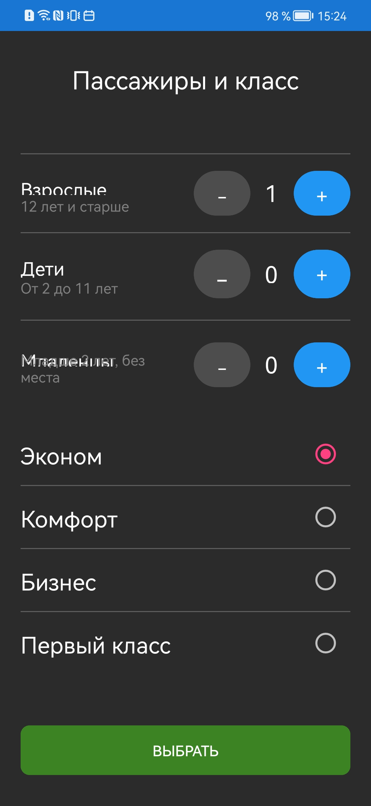
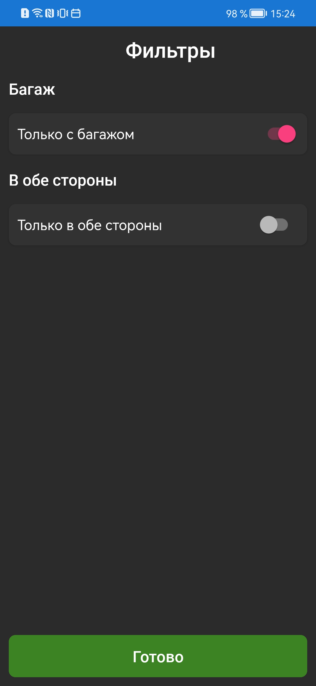
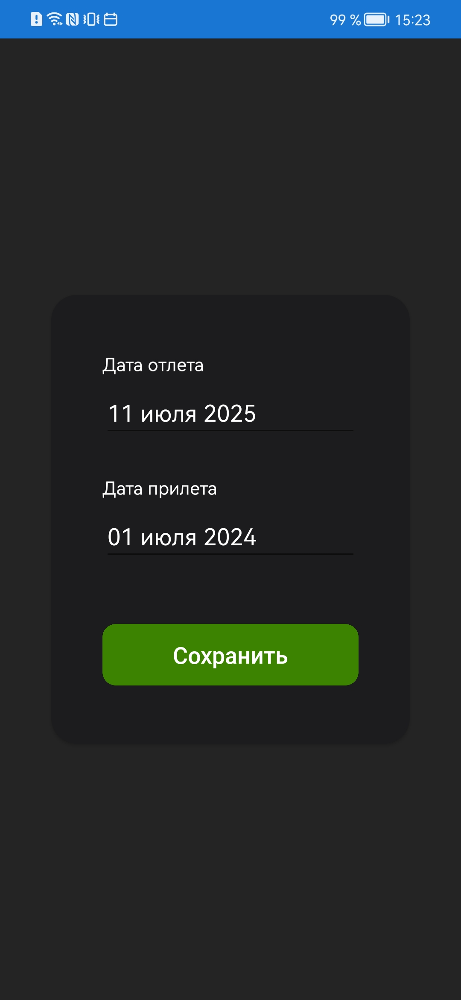

<div align="center">
  <h1>✈️ Калькулятор стоимости авиабилетов «Белавиа»</h1>
  <h3>Мобильное приложение для авиакомпании «Белавиа» | Курсовой проект</h3>
  
  <p>
    
    
  </p>
  
  <p>
    
    
    
    
  </p>
</div>

---

## 📝 Оглавление
- [📌 О проекте](#-о-проекте)
- [🚀 Быстрый старт](#-быстрый-старт)
- [🛠️ Функционал](#️-функционал)
- [🏗️ Архитектура](#️-архитектура)
- [🖥️ Скриншоты](#️-скриншоты)
- [🤝 Как помочь проекту](#-как-помочь-проекту)
- [📜 Лицензия](#-лицензия)

---

## 📌 О проекте
Мобильное приложение для автоматизации расчета стоимости авиабилетов авиакомпании «Белавиа», разработанное в рамках курсового проекта.

**Основные цели:**
- ✅ Автоматизация расчета стоимости билетов
- ✅ Упрощение поиска доступных рейсов
- ✅ Улучшение пользовательского опыта
- ✅ Обеспечение надежного управления данными

### 👥 Роли пользователей
| Роль | Иконка | Доступ |
|------|--------|--------|
| **Пассажир** | ✈️ | Поиск и покупка билетов |
| **Сотрудник** | 👨‍✈️ | Управление рейсами |
| **Администратор** | 👨‍💼 | Полный доступ к системе |

---

## 🚀 Быстрый старт

### 📋 Системные требования
| Компонент | Версия |
|-----------|--------|
| Xamarin.Forms | 5.0+ |
| .NET | 6.0+ |
| SQLite | 3.35+ |
| Visual Studio | 2022+ |

### ⚙️ Установка
```bash
# 1. Клонирование репозитория
git clone https://github.com/yourusername/belavia-flight-calculator.git
cd belavia-flight-calculator

# 2. Восстановление зависимостей
dotnet restore

# 3. Сборка проекта
dotnet build

# 4. Запуск приложения
dotnet run
```
### Скриншоты интерфейса (`## 🖥️ Скриншоты интерфейса`)
<div align="center">
  <h3>Главная страница</h3>
  
  <h3>Страница параметров по поиску билетов</h3>  
  
  <h3>Страница фильтров билетов</h3>
  
  <h3>Страница настроек и профиля</h3>  
  
  <h3>Страница билета</h3>  
  
  <h3>Страница выбора даты</h3>
  

</div>
